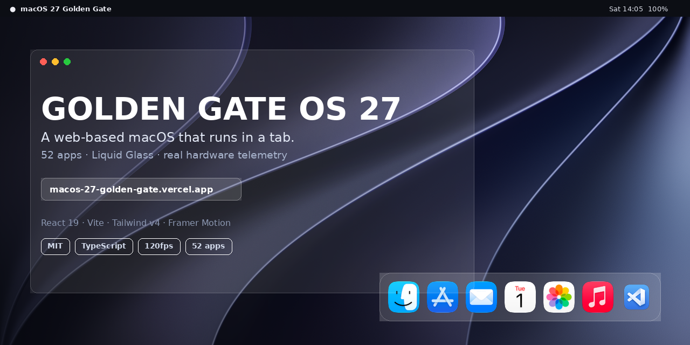

# Golden Gate OS 27

**A macOS 27 simulator that runs entirely in a browser tab.** 52 working apps, a
Liquid Glass dock, Dynamic Island, and telemetry wired to the real Battery,
Memory and Storage APIs — not mocked values.

<p align="center">
  <a href="https://macos-27-golden-gate.vercel.app">
    
  </a>
</p>

<p align="center">
  <a href="https://macos-27-golden-gate.vercel.app"><b>▶ Open it live</b></a>
  &nbsp;·&nbsp;
  <a href="#run-it-locally">Run locally</a>
  &nbsp;·&nbsp;
  <a href="LICENSE">MIT</a>
</p>

---

## Why this exists

Most "web OS" demos are static mockups — images of windows that don't open. This
one is a real application:

- **52 apps that actually do something.** Calculator computes. Files browses. The
  terminal runs. Chess is playable.
- **The telemetry is real.** The battery, memory and storage readouts come from
  the browser's device APIs. On a laptop they show that laptop's actual state.
- **No install, no account, no build step.** Open the URL and the desktop loads.

## Quick start

You do not need to run anything. **[Open the live build →](https://macos-27-golden-gate.vercel.app)**

<details>
<summary><b>Run it locally</b> (Node 18+)</summary>

```bash
cd Skills/showcase/restaurants/macOS-evolution/"Modern MacOS (2020 to 2026)"/macOS\ 27\ Golden\ Gate/golden-gate-os-v27

npm install
npm run dev      # http://localhost:5173
npm run build    # production build
npm run test     # vitest
```

Requires Node 18+. A Chrome-based browser gives you the full hardware telemetry;
Safari and Firefox run the OS but report partial device data.

</details>

## What's inside

| Area | Detail |
|---|---|
| **Stack** | React 19 · Vite · Tailwind CSS v4 · Framer Motion · TypeScript |
| **Apps** | 52 shipped, each wired to real logic rather than a placeholder |
| **Dock** | 25-node live array with magnification and running-state indicators |
| **Design** | Liquid Glass 2.0 — real backdrop blur, refraction and specular edges |
| **Extras** | Dynamic Island · Siri routing · iPhone Mirroring · OTA updates |
| **Telemetry** | Battery Status, Device Memory and Storage Estimation APIs |
| **MCP** | Ships its own model-context-protocol server (`npm run mcp-server`) |

## The agent skills

The `Skills/` directory holds the prompt and constraint system this project was
built with — recipes that force a coding agent to emit code instead of prose:

- **`caveman-full-stack-developer.md`** — a full-stack generator with an
  explicit no-preamble contract. Cuts token waste by suppressing the
  conversational scaffolding most agents emit.
- **`caveman-hardware-design-functional.md`** — the same constraint applied to
  hardware-aware UI.
- **[`Skills/CONTRIBUTOR.md`](Skills/CONTRIBUTOR.md)** — the rules for
  submitting a skill. Contributions welcome; read this first.

These are the reusable part. The simulator is the proof they work.

## Project layout

```
Skills/
├── caveman-full-stack-developer.md      # agent skill
├── caveman-hardware-design-functional.md
├── CONTRIBUTOR.md                      # how to contribute a skill
└── showcase/restaurants/macOS-evolution/
    └── Modern MacOS (2020 to 2026)/macOS 27 Golden Gate/
        └── golden-gate-os-v27/          # the simulator itself (Vite + React)
            ├── src/
            ├── public/wallpapers/
            ├── mcp-server/
            └── tests/
```

> The nested path is historical — the project grew outward from a single
> showcase folder and kept its original location. It is ugly and stable.

## Contributing

Skills are the easiest place to start. Read
[`Skills/CONTRIBUTOR.md`](Skills/CONTRIBUTOR.md), follow the Caveman Protocol,
and open a PR.

For the simulator itself, see [`AGENTS.md`](Skills/showcase/restaurants/macOS-evolution/Modern%20MacOS%20%282020%20to%202026%29/macOS%2027%20Golden%20Gate/golden-gate-os-v27/AGENTS.md)
and [`MCP-GUIDE.md`](Skills/showcase/restaurants/macOS-evolution/Modern%20MacOS%20%282020%20to%202026%29/macOS%2027%20Golden%20Gate/golden-gate-os-v27/MCP-GUIDE.md).

## License

MIT © 2026 [Aashman Shukla](https://github.com/AashmanShukla3223) — see [LICENSE](LICENSE).
