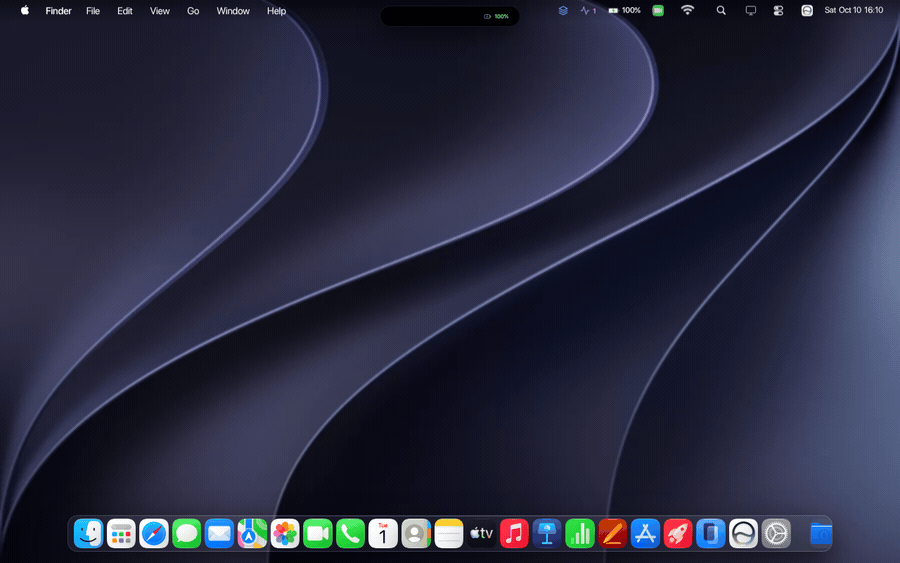

# Golden Gate OS 27

**A macOS 27 simulator that runs entirely in a browser tab.** 52 working apps, a
Liquid Glass dock, Dynamic Island, and telemetry wired to the real Battery,
Memory and Storage APIs — not mocked values.

**[▶ Open it live →](https://macos-27-golden-gate.vercel.app)**

<p align="center">
  
</p>

<p align="center"><sub>
  Recorded from the real build — open a window, then try the full thing.
</sub></p>

<p align="center">
  
</p>

<p align="center">
  React 19 &nbsp;·&nbsp; Vite &nbsp;·&nbsp; Tailwind CSS v4 &nbsp;·&nbsp; Framer Motion &nbsp;·&nbsp; TypeScript
  <br>
  <a href="#run-it-locally">Run locally</a> &nbsp;·&nbsp; <a href="#the-agent-skills">Agent skills</a> &nbsp;·&nbsp; MIT
</p>

---

## Why this exists

Most "web OS" demos are static mockups — images of windows that don't open.
This one is a real application:

- **52 apps that actually do something.** Calculator computes. Files browses.
  The terminal runs. Chess is playable.
- **The telemetry is real.** The battery, memory and storage readouts come from
  the browser's device APIs. On a laptop they show that laptop's actual state.
- **No install, no account, no build step.** Open the URL and the desktop loads.

## What's inside

| Area | Detail |
|---|---|
| **Stack** | React 19 · Vite · Tailwind CSS v4 · Framer Motion · TypeScript |
| **Apps** | 52 shipped, each wired to real logic rather than a placeholder |
| **Dock** | 25-node live array with magnification and running-state indicators |
| **Design** | Liquid Glass 2.0 — real backdrop blur, refraction and specular edges |
| **Extras** | Dynamic Island · Siri routing · iPhone Mirroring · OTA updates |
| **Telemetry** | Battery Status, Device Memory and Storage Estimation APIs |
| **MCP** | Ships its own model-context-protocol server (`npm run mcp-server`) |

## Run it locally

Requires Node 18+. A Chrome-based browser gives you the full hardware
telemetry; Safari and Firefox run the OS but report partial device data.

```bash
git clone https://github.com/AashmanShukla3223/Antigravity-and-OpenCode-CLI-Prompts-and-Skills
cd "Antigravity-and-OpenCode-CLI-Prompts-and-Skills/Skills/showcase/restaurants/macOS-evolution/Modern MacOS (2020 to 2026)/macOS 27 Golden Gate/golden-gate-os-v27"

npm install
npm run dev      # http://localhost:5173
npm run build    # production build
npm run test     # vitest
```

## The agent skills

This simulator was built by an AI agent driving a set of reusable prompt
skills that live in [`Skills/`](Skills/) at the repo root:

- **[`caveman-full-stack-developer.md`](Skills/caveman-full-stack-developer.md)**
  — a full-stack generator with an explicit no-preamble contract that suppresses
  the conversational scaffolding most agents emit.
- **[`caveman-hardware-design-functional.md`](Skills/caveman-hardware-design-functional.md)**
  — the same constraint applied to hardware-aware and system-level UI.
- **[`Skills/CONTRIBUTOR.md`](Skills/CONTRIBUTOR.md)** — how to add your own.

They work with OpenCode, Antigravity, Gemini CLI and Claude Code. The
simulator is the proof they work — contributions welcome.

## Project layout

```
Skills/showcase/restaurants/macOS-evolution/
└── Modern MacOS (2020 to 2026)/
    └── macOS 27 Golden Gate/
        ├── README.md
        └── golden-gate-os-v27/          # the simulator (Vite + React)
            ├── src/                     # 52 apps, dock, window manager
            ├── public/wallpapers/
            ├── mcp-server/              # model-context-protocol server
            └── tests/
```

> The nested path is historical — the project grew outward from a single
> showcase folder and kept its original location. It's ugly and stable.

Docs for the app itself live alongside it:
[`AGENTS.md`](Skills/showcase/restaurants/macOS-evolution/Modern%20MacOS%20%282020%20to%202026%29/macOS%2027%20Golden%20Gate/golden-gate-os-v27/AGENTS.md) ·
[`MCP-GUIDE.md`](Skills/showcase/restaurants/macOS-evolution/Modern%20MacOS%20%282020%20to%202026%29/macOS%2027%20Golden%20Gate/golden-gate-os-v27/MCP-GUIDE.md)

## Regenerating the demo GIF

The GIF at the top is recorded from the real build, not mocked up — it drives
the shipped app in headless Chromium with Playwright, clicks actual dock icons,
and encodes the frames with ffmpeg.

```bash
# build first; the scripts record the production bundle, not the dev server
cd "Skills/showcase/restaurants/macOS-evolution/Modern MacOS (2020 to 2026)/macOS 27 Golden Gate/golden-gate-os-v27"
npm run build && cd -

node scripts/make_demo_gif.mjs --keep-frames   # frames + .github/demo.gif
python3 scripts/make_banner.py                  # banner + desktop still

node scripts/make_demo_gif.mjs --dry-run         # just verify it boots
```

Requires Node 18+, Playwright with Chromium, `ffmpeg`, and Pillow.

Both assets are generated from the running app — `social-preview.png` is a real
screenshot with the title treatment drawn over it, not a mockup.

## License

MIT © 2026 [Aashman Shukla](https://github.com/AashmanShukla3223) — see [LICENSE](LICENSE).